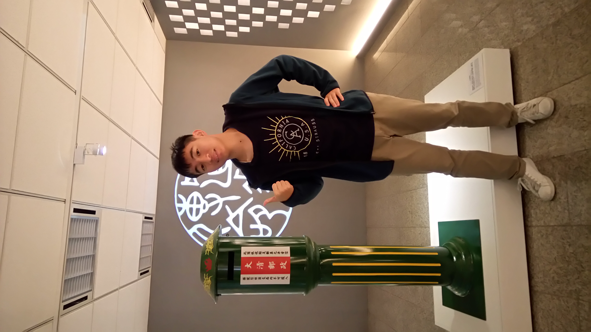

<html>
<head>
<title>Page Title</title>

</head>
<body>

<h1>我的博客</h1>

<marquee behavior="alternate">這裡是我的簡介 歡迎多認識我喔!!!</marquee>

姓名: 蔡濬鍇 Kenny

性別: 男性

生日: 2000/12/24

星座: 摩羯座

感情狀態: 單身

學歷: 士東國小→薇閣中學→清大資工23級

家鄉: 台北

電話: 0988068646

email: 
<a href="https://a24332352@gmail.com"target="_blank">a24332352@gmail.com</a>

興趣:

<ul>
<li>
關注時事
</li>
<li>
熱愛研究超自然現象
</li>
<li>
職業運動狂粉
</li>
<li>
扭蛋小型玩家
</li>
</ul>

歡迎前往我的
<a href="URL"><a href="https://www.facebook.com/kennytsai1224"target="_blank">個人臉書專頁</a>
來更加認識我喔!
 

<body onload="ShowTime()">

